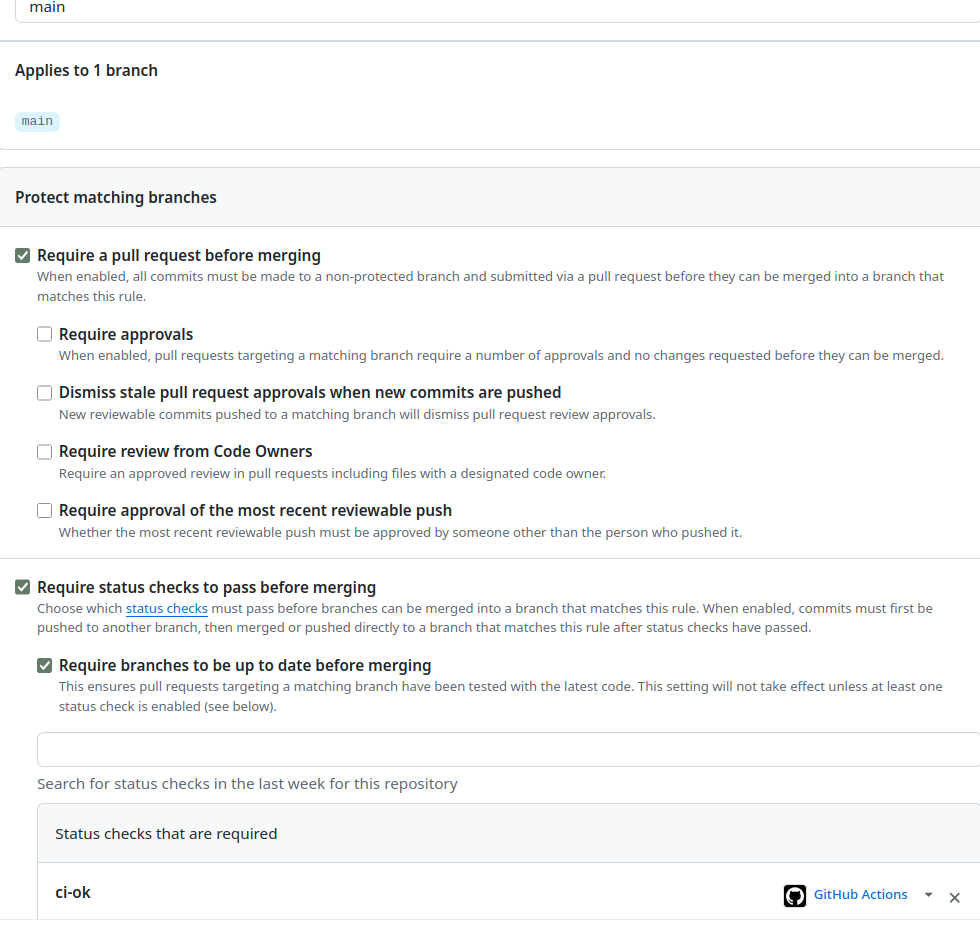

# Lab 3 — CI/CD: A PR-Gated Pipeline for QuickNotes

Student: Arina ([@sonder314](https://github.com/sonder314))

Branch: `feature/lab3`

Chosen path: **GitHub Actions**

I chose GitHub Actions because the repository and pull-request workflow are on
GitHub. Keeping the gate beside the pull request makes the status checks visible
where I decide whether a change is ready to merge.

## Result

My workflow is in [`.github/workflows/ci.yml`](../.github/workflows/ci.yml). It
runs independent `vet`, `test` and `lint` jobs on `ubuntu-24.04`, followed by one
`ci-ok` aggregation check. The final full run in my fork is
[34768910452](https://github.com/sonder314/DevOps-Intro/actions/runs/34768910452).
The full cached matrix run completed in 48 seconds, below the 90-second bonus
target.

## Task 1 — PR gate

The heavyweight workflow runs for pushes to `main` and pull requests targeting
`main` when the application or a CI workflow changes. Both `vet` and
race-enabled tests run against Go 1.23 and 1.24. Lint runs independently with
golangci-lint v2.5.0. `ci-ok` uses `if: always()` and depends on all three job
groups, so any failed, cancelled or skipped dependency makes the required gate
fail.

I pinned the execution environment and every reusable action:

| Component | Pinned value |
|---|---|
| Runner | `ubuntu-24.04` |
| Go matrix | `1.23`, `1.24` |
| golangci-lint | `v2.5.0` |
| `actions/checkout` | `11bd71901bbe5b1630ceea73d27597364c9af683` (`v4.2.2`) |
| `actions/setup-go` | `d35c59abb061a4a6fb18e82ac0862c26744d6ab5` (`v5.5.0`) |
| `golangci/golangci-lint-action` | `4afd733a84b1f43292c63897423277bb7f4313a9` (`v8.0.0`) |

I resolved each tag to its commit directly from the action repository before
writing the workflow. Workflow permissions are limited to `contents: read`.

### Deliberate failure and recovery

I committed `b2b963ed141898104136259817c99fe9831998c4`, which deliberately made
`TestCreateNote_RoundTrip` expect HTTP 200 instead of the correct HTTP 201. In
[the failed run](https://github.com/sonder314/DevOps-Intro/actions/runs/34768409673),
both matrix test jobs failed while both vet jobs and lint passed. The `ci-ok`
gate failed and the PR API reported `mergeable_state=unstable`.

I then created the signed revert commit
`fcf2c1e9d450626a10ba91c54fa0ab5bca3c6b6a`. All checks passed in
[the recovery run](https://github.com/sonder314/DevOps-Intro/actions/runs/34768511781).
The captured status list and local failure are in
[`failure-and-recovery.txt`](evidence/lab3/failure-and-recovery.txt).

### Branch protection

My fork's `main` rule requires a pull request, requires `ci-ok`, and requires the
branch to be up to date before merging. Existing signed-commit and linear-history
requirements from the earlier labs remain enabled.

### Design questions

**a) Why pin `ubuntu-24.04`?** `ubuntu-latest` is a moving label. When GitHub
retargets it, the preinstalled compiler, system libraries and tools can change
without a repository commit, which can break a previously reproducible build.
A named LTS image makes environment upgrades deliberate and reviewable.

**b) Why use separate jobs?** Independent jobs run in parallel, show exactly
which class of check failed and let me rerun or inspect that unit alone. In one
combined job the commands normally run serially, a first failure hides later
results, and the slowest sequence rather than the slowest parallel branch sets
the wall-clock time.

**c) What does SHA pinning prevent?** A tag such as `v4` can be moved to a new
commit after review. In **March 2025**, the `tj-actions/changed-files` action was
compromised and its tags were rewritten to malicious code that exposed secrets
in CI logs, as described in [Lecture 3](../lectures/lec3.md) and the
[incident analysis](https://www.stepsecurity.io/blog/harden-runner-detection-tj-actions-changed-files-action-is-compromised).
A verified full commit SHA keeps the selected source immutable even if a tag is
later moved. GitHub likewise describes a full SHA as the immutable way to select
an action in its [secure-use reference](https://docs.github.com/en/actions/reference/security/secure-use).

**d) What is `permissions:`?** It sets the scopes granted to the workflow's
temporary `GITHUB_TOKEN`. I grant only `contents: read`, which is sufficient for
checkout; unspecified scopes become `none`. This follows least privilege: a
compromised step receives only the access needed for its job. The behavior is
defined in GitHub's [workflow syntax reference](https://docs.github.com/en/actions/reference/workflows-and-actions/workflow-syntax#permissions).

**e) GitLab stage versus job.** I did not use the GitLab path, but the concepts
are distinct: a job is one executable unit with its own script and runner, while
a stage groups jobs into an ordering boundary. Jobs in one stage can run in
parallel and the next stage waits for them. `dependencies:` controls which
earlier jobs' artifacts a job downloads; it does not define the stage order.

## Task 2 — Fast and selective execution

### Measurements

| Scenario | Wall-clock | Run |
|---|---:|---|
| Baseline: no setup-go cache, one Go version, no path filter | 36 s | [34767575425](https://github.com/sonder314/DevOps-Intro/actions/runs/34767575425) |
| Cache enabled, one Go version, no path filter | 39 s | [34767800267](https://github.com/sonder314/DevOps-Intro/actions/runs/34767800267) |
| Cache, Go 1.23/1.24 matrix and path filter | 48 s | [34768002829](https://github.com/sonder314/DevOps-Intro/actions/runs/34768002829) |

These are completed-run timestamps from the public GitHub API. The supporting
records are [`baseline-timing.txt`](evidence/lab3/baseline-timing.txt),
[`cache-timing.txt`](evidence/lab3/cache-timing.txt), and
[`matrix-timing.txt`](evidence/lab3/matrix-timing.txt).

The cached single-version run was three seconds slower than the baseline. This
is normal runner variance rather than a cache regression: QuickNotes has no
third-party requirements and no `go.sum`, so the module cache has nothing to
restore. I used `app/go.mod` as the cache dependency manifest; the Go build cache
is the only reusable content here. A dependency-heavy application would benefit
mainly in dependency setup and compilation steps.

The matrix has `fail-fast: false`, so both Go cells report their result even when
one fails. The heavyweight trigger filters to `app/**` and
`.github/workflows/**`; a repository-documentation-only PR is recorded in the
demonstration below.

### Docs-only demonstration

I opened [docs-only PR #3](https://github.com/sonder314/DevOps-Intro/pull/3)
with one file under `docs/` and no application or workflow changes. The
heavyweight `CI` workflow produced no run, proving that its path filter skipped
the PR. The first version also left required `ci-ok` at `Expected`, captured in
[`docs-only-pending.png`](evidence/lab3/docs-only-pending.png). This is GitHub's
documented behavior when an entire required workflow is skipped by a path
filter, so waiting longer could never complete it.

I fixed the interaction in
[PR #4](https://github.com/sonder314/DevOps-Intro/pull/4) with a mutually
exclusive [documentation gate](../.github/workflows/docs-only.yml). It runs one
lightweight `ci-ok` only when neither `app/**` nor `.github/workflows/**`
changed. After the fix, the documentation runs
[34770289000](https://github.com/sonder314/DevOps-Intro/actions/runs/34770289000)
and
[34770308456](https://github.com/sonder314/DevOps-Intro/actions/runs/34770308456)
completed successfully with no vet, test or lint jobs. PR #3 then merged into
protected `main`; its squash commit `a23d3a13b6c9da7b8781da22d0716d6dcba23f21`
is Verified. This preserves a stable required check without spending the full
matrix cost on documentation. GitHub describes the underlying pending-check
behavior in
[Troubleshooting required status checks](https://docs.github.com/en/repositories/configuring-branches-and-merges-in-your-repository/managing-protected-branches/troubleshooting-required-status-checks#handling-skipped-but-required-checks).

### Task 2 design questions

**f) Why key cache data from dependency inputs?** `go.sum` identifies exact
downloaded module content, so a changed dependency naturally produces a new
cache key. This repository has no `go.sum`, so I key from `go.mod`, its only
dependency manifest. Compiled deliverables depend on the OS, architecture,
compiler and flags and can become stale or unsafe when reused as release output.
The build cache is treated only as disposable acceleration and can always be
regenerated; it is not a published artifact.

**g) What does `fail-fast: false` change?** GitHub keeps the other matrix cells
running after one cell fails, which gives a complete compatibility picture. I
would use `fail-fast: true` for expensive, redundant cells when one failure
already invalidates the whole result and fast feedback or CI cost matters more
than seeing every combination.

**h) What is cache poisoning?** An attacker can arrange for a malicious PR to
store executable or generated content in a cache; a later privileged run could
restore and execute it. GitHub mitigates this by scoping ordinary
`pull_request` caches to the merge ref and preventing them from writing the
default branch's cache scope. Low-trust triggers that resolve to the default
branch receive read-only cache access unless that safety is explicitly
overridden. I also keep this workflow on `pull_request`, grant only
`contents: read`, store no secrets in cached paths and treat cache contents as
disposable. See GitHub's [dependency caching security reference](https://docs.github.com/en/actions/reference/workflows-and-actions/dependency-caching#cache-access-for-low-trust-workflow-triggers).

## Bonus — Pipeline performance investigation

### Profile of the full matrix run

Durations below use job and step timestamps from run `34768002829`.
"Startup" is the queue before the runner started, and cleanup is the interval
after the main work step through job completion.

| Unit | Startup | Dependency setup | Work | Cleanup | Job total |
|---|---:|---:|---:|---:|---:|
| lint | 2 s | 1 s | 5 s | 2 s | 12 s |
| vet (Go 1.23) | 2 s | 8 s | 17 s | 7 s | 35 s |
| vet (Go 1.24) | 3 s | 3 s | 3 s | 3 s | 12 s |
| test (Go 1.23) | 2 s | 9 s | 22 s | 4 s | 38 s |
| test (Go 1.24) | 2 s | 2 s | 22 s | 3 s | 30 s |

### Additional optimizations

I applied these measures in addition to Task 2's cache, matrix and path filter:

1. I run vet, tests and lint concurrently, with only the lightweight `ci-ok`
   job waiting for them.
2. I reduced checkout from full history (`fetch-depth: 0`) to one commit because
   no check needs repository history.
3. I set `GOFLAGS=-buildvcs=false` so Go does not inspect VCS metadata that the
   CI result does not use.
4. I added concurrency cancellation, so a new push cancels an obsolete run for
   the same PR instead of wasting runner time.
5. I added short job timeouts so a hung tool cannot consume runner time for the
   platform default duration.
6. I disabled persisted checkout credentials because none of the checks pushes
   repository changes; later shell steps therefore cannot reuse that token.
7. I use a one-step documentation gate so docs-only pull requests satisfy branch
   protection without provisioning five Go/linter jobs.

The timings do not isolate one variable per run, so I do not claim causation for
normal runner variance. They show the observed step changes after the final
configuration and warmed caches:

| Optimization applied | Before | After | Observed difference |
|---|---:|---:|---:|
| Shallow checkout | 1 s | 1 s | 0 s |
| Warm build cache plus disabled VCS stamping | 16 s vet | 3 s vet on Go 1.24 | -13 s |
| Warm linter cache | 21 s lint | 5 s lint | -16 s |
| **Full wall-clock** | **36 s baseline** | **48 s full matrix** | **+12 s** |

The matrix adds coverage, so its total being longer than the single-version
baseline is expected even though its cells run in parallel.

### Bottleneck analysis

The remaining dominant work is the race-enabled test step at 22 seconds in each
Go cell. The Go 1.23 cell also spends extra time selecting a compatible
toolchain because `app/go.mod` requires Go 1.24; the official
[Go toolchain selection rules](https://go.dev/doc/toolchain) explain this
automatic behavior. To shorten the application work itself, I would reduce
test-process startup and split a larger test suite into balanced packages that
Go can execute concurrently, while keeping the race detector in the PR gate.
I would stop optimizing this pipeline at roughly one minute because it already
meets the 90-second target and further complexity would cost more maintenance
than the few seconds saved. The useful next optimization point would be after
the application gains enough dependencies or tests to change the bottleneck.

## Submission readiness

- [x] Workflow has independent vet, test and lint units.
- [x] Runner, linter and every action are pinned.
- [x] Workflow token uses least privilege.
- [x] Signed deliberate failure and signed recovery are documented.
- [x] Cache, matrix, `fail-fast: false` and path filters are configured.
- [x] Three actual timing scenarios and per-step profile are recorded.
- [x] Branch protection requires the robust `ci-ok` gate.
- [x] Branch-protection screenshot saved in the repository.
- [x] Docs-only skip PR demonstrated and recorded.
- [ ] Final upstream PR opened and newest commit checked as Verified.
- [ ] PR URL submitted through Moodle before the deadline.
